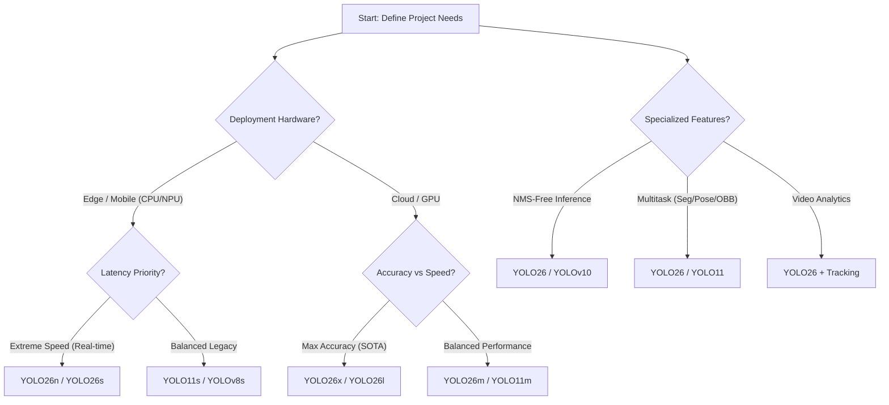

# Model Comparisons: Choose the Best Object Detection Model for Your Project

Choosing the right neural network architecture is the cornerstone of any successful [computer vision](https://www.ultralytics.com/glossary/computer-vision-cv) project. Welcome to the **Ultralytics Model Comparison Hub**! This page centralizes detailed technical analyses and performance benchmarks, dissecting the trade-offs between the latest [Ultralytics YOLO26](https://docs.ultralytics.com/models/yolo26/) and other leading architectures like YOLO11, YOLOv10, RT-DETR, and EfficientDet.

Whether your application demands the millisecond latency of [edge AI](https://www.ultralytics.com/glossary/edge-ai) or the high-fidelity precision required for medical imaging, this guide provides the data-driven insights needed to make an informed choice. We evaluate models based on [mean Average Precision (mAP)](https://www.ultralytics.com/glossary/mean-average-precision-map), [inference speed](https://www.ultralytics.com/glossary/inference-latency), parameter efficiency, and ease of deployment.

## Interactive Performance Benchmarks

Visualizing the relationship between speed and accuracy is essential for identifying the "Pareto frontier" of object detection—models that offer the best accuracy for a given speed constraint. The chart below contrasts key metrics on standard [datasets like COCO](https://docs.ultralytics.com/datasets/detect/coco/).

<canvas id="modelComparisonChart" width="1024" height="400"></canvas>

This chart visualizes key [performance metrics](https://docs.ultralytics.com/guides/yolo-performance-metrics/) enabling you to quickly assess the trade-offs between different models. Understanding these metrics is fundamental to selecting a model that aligns with your specific deployment constraints.

## Quick Decision Guide

Not sure where to start? Use this decision tree to narrow down the architecture that best fits your hardware and performance requirements.

## The Current Landscape: YOLO26 and Beyond

The field of object detection moves rapidly. While older models remain relevant for legacy support, new architectures push the boundaries of what is possible.

### [Ultralytics YOLO26](../models/yolo26.md)

Released in January 2026, **YOLO26** is the latest state-of-the-art model and the recommended starting point for all new projects. It introduces groundbreaking architectural innovations including an **End-to-End NMS-Free Design** that eliminates the need for Non-Maximum Suppression post-processing, resulting in faster and more predictable inference times. YOLO26 is up to **43% faster on CPUs** compared to previous generations, making it ideal for edge deployment.

Key innovations include:

- **NMS-Free End-to-End:** Simplified deployment with no post-processing required
- **DFL Removal:** Streamlined exports to ONNX, TensorRT, and CoreML
- **MuSGD Optimizer:** Hybrid SGD/Muon optimizer inspired by LLM training for stable convergence
- **ProgLoss + STAL:** Enhanced small object detection performance

!!! tip "Why Choose YOLO26?"

    YOLO26 represents the pinnacle of Ultralytics engineering, combining the best of CNN efficiency with transformer-like end-to-end capabilities. It supports all tasks—detection, segmentation, pose estimation, classification, and OBB—while being smaller, faster, and easier to deploy than ever before.

### [Ultralytics YOLO11](../models/yolo11.md)

**YOLO11** remains a highly capable model, offering a 22% reduction in parameters compared to YOLOv8 while improving detection accuracy. It is fully supported and recommended for users who need proven stability or have existing YOLO11 pipelines.

### Community Models: A Note on YOLO12 and YOLO13

You may encounter references to **YOLO12** or **YOLO13** in community discussions or repositories.

!!! warning "Production Caution"

    We currently **do not recommend** YOLO12 or YOLO13 for production use.

    *   **YOLO12:** Utilizes attention layers that often cause training instability, excessive memory consumption, and significantly slower CPU inference speeds.
    *   **YOLO13:** Benchmarks indicate only marginal accuracy gains over YOLO11 while being larger and slower. Reported results have shown issues with reproducibility.

   
  <iframe loading="lazy" width="720" height="405" src="https://www.youtube.com/embed/POlQ8MIHhlM"
    title="YouTube video player" frameborder="0"
    allow="accelerometer; autoplay; clipboard-write; encrypted-media; gyroscope; picture-in-picture; web-share"
    allowfullscreen>
  </iframe>
   
  <strong>Watch:</strong> YOLO Models Comparison: Ultralytics YOLO11 vs. YOLOv10 vs. YOLOv9 vs. Ultralytics YOLOv8

## Detailed Model Comparisons

Explore our in-depth technical comparisons to understand specific architectural differences, such as backbone selection, head design, and loss functions. We've organized them by model for easy access:

### [YOLO26](../models/yolo26.md) vs

YOLO26 is the latest Ultralytics model featuring NMS-free end-to-end detection, the MuSGD optimizer, and up to 43% faster CPU inference. It's optimized for edge deployment while achieving state-of-the-art accuracy.

- [YOLO26 vs YOLO11](yolo26-vs-yolo11.md)
- [YOLO26 vs YOLOv10](yolo26-vs-yolov10.md)
- [YOLO26 vs YOLOv9](yolo26-vs-yolov9.md)
- [YOLO26 vs YOLOv8](yolo26-vs-yolov8.md)
- [YOLO26 vs YOLOv7](yolo26-vs-yolov7.md)
- [YOLO26 vs YOLOv6-3.0](yolo26-vs-yolov6.md)
- [YOLO26 vs YOLOv5](yolo26-vs-yolov5.md)
- [YOLO26 vs PP-YOLOE+](yolo26-vs-pp-yoloe.md)
- [YOLO26 vs DAMO-YOLO](yolo26-vs-damo-yolo.md)
- [YOLO26 vs YOLOX](yolo26-vs-yolox.md)
- [YOLO26 vs RT-DETR](yolo26-vs-rtdetr.md)
- [YOLO26 vs EfficientDet](yolo26-vs-efficientdet.md)

### [YOLO11](../models/yolo11.md) vs

YOLO11 builds upon the success of its predecessors with cutting-edge research. It features an improved backbone and neck architecture for better feature extraction and optimized efficiency.

- [YOLO11 vs YOLO26](yolo11-vs-yolo26.md)
- [YOLO11 vs YOLOv10](yolo11-vs-yolov10.md)
- [YOLO11 vs YOLOv9](yolo11-vs-yolov9.md)
- [YOLO11 vs YOLOv8](yolo11-vs-yolov8.md)
- [YOLO11 vs YOLOv7](yolo11-vs-yolov7.md)
- [YOLO11 vs YOLOv6-3.0](yolo11-vs-yolov6.md)
- [YOLO11 vs YOLOv5](yolo11-vs-yolov5.md)
- [YOLO11 vs PP-YOLOE+](yolo11-vs-pp-yoloe.md)
- [YOLO11 vs DAMO-YOLO](yolo11-vs-damo-yolo.md)
- [YOLO11 vs YOLOX](yolo11-vs-yolox.md)
- [YOLO11 vs RT-DETR](yolo11-vs-rtdetr.md)
- [YOLO11 vs EfficientDet](yolo11-vs-efficientdet.md)

### [YOLOv10](../models/yolov10.md) vs

Developed by Tsinghua University, YOLOv10 focuses on removing the [Non-Maximum Suppression (NMS)](https://www.ultralytics.com/glossary/non-maximum-suppression-nms) step to reduce latency variance, offering state-of-the-art performance with reduced computational overhead.

- [YOLOv10 vs YOLO26](yolov10-vs-yolo26.md)
- [YOLOv10 vs YOLO11](yolov10-vs-yolo11.md)
- [YOLOv10 vs YOLOv9](yolov10-vs-yolov9.md)
- [YOLOv10 vs YOLOv8](yolov10-vs-yolov8.md)
- [YOLOv10 vs YOLOv7](yolov10-vs-yolov7.md)
- [YOLOv10 vs YOLOv6-3.0](yolov10-vs-yolov6.md)
- [YOLOv10 vs YOLOv5](yolov10-vs-yolov5.md)
- [YOLOv10 vs PP-YOLOE+](yolov10-vs-pp-yoloe.md)
- [YOLOv10 vs DAMO-YOLO](yolov10-vs-damo-yolo.md)
- [YOLOv10 vs YOLOX](yolov10-vs-yolox.md)
- [YOLOv10 vs RT-DETR](yolov10-vs-rtdetr.md)
- [YOLOv10 vs EfficientDet](yolov10-vs-efficientdet.md)

### [YOLOv9](../models/yolov9.md) vs

YOLOv9 introduces Programmable Gradient Information (PGI) and the Generalized Efficient Layer Aggregation Network (GELAN) to address information loss in deep neural networks.

- [YOLOv9 vs YOLO26](yolov9-vs-yolo26.md)
- [YOLOv9 vs YOLO11](yolov9-vs-yolo11.md)
- [YOLOv9 vs YOLOv10](yolov9-vs-yolov10.md)
- [YOLOv9 vs YOLOv8](yolov9-vs-yolov8.md)
- [YOLOv9 vs YOLOv7](yolov9-vs-yolov7.md)
- [YOLOv9 vs YOLOv6-3.0](yolov9-vs-yolov6.md)
- [YOLOv9 vs YOLOv5](yolov9-vs-yolov5.md)
- [YOLOv9 vs PP-YOLOE+](yolov9-vs-pp-yoloe.md)
- [YOLOv9 vs DAMO-YOLO](yolov9-vs-damo-yolo.md)
- [YOLOv9 vs YOLOX](yolov9-vs-yolox.md)
- [YOLOv9 vs RT-DETR](yolov9-vs-rtdetr.md)
- [YOLOv9 vs EfficientDet](yolov9-vs-efficientdet.md)

### [YOLOv8](../models/yolov8.md) vs

Ultralytics YOLOv8 remains a highly popular choice, featuring advanced backbone and neck architectures and an anchor-free split head for optimal accuracy-speed tradeoffs.

- [YOLOv8 vs YOLO26](yolov8-vs-yolo26.md)
- [YOLOv8 vs YOLO11](yolov8-vs-yolo11.md)
- [YOLOv8 vs YOLOv10](yolov8-vs-yolov10.md)
- [YOLOv8 vs YOLOv9](yolov8-vs-yolov9.md)
- [YOLOv8 vs YOLOv7](yolov8-vs-yolov7.md)
- [YOLOv8 vs YOLOv6-3.0](yolov8-vs-yolov6.md)
- [YOLOv8 vs YOLOv5](yolov8-vs-yolov5.md)
- [YOLOv8 vs PP-YOLOE+](yolov8-vs-pp-yoloe.md)
- [YOLOv8 vs DAMO-YOLO](yolov8-vs-damo-yolo.md)
- [YOLOv8 vs YOLOX](yolov8-vs-yolox.md)
- [YOLOv8 vs RT-DETR](yolov8-vs-rtdetr.md)
- [YOLOv8 vs EfficientDet](yolov8-vs-efficientdet.md)

### [YOLOv7](../models/yolov7.md) vs

YOLOv7 introduced "trainable bag-of-freebies" and model re-parameterization, focusing on optimizing the training process without increasing inference costs.

- [YOLOv7 vs YOLO26](yolov7-vs-yolo26.md)
- [YOLOv7 vs YOLO11](yolov7-vs-yolo11.md)
- [YOLOv7 vs YOLOv10](yolov7-vs-yolov10.md)
- [YOLOv7 vs YOLOv9](yolov7-vs-yolov9.md)
- [YOLOv7 vs YOLOv8](yolov7-vs-yolov8.md)
- [YOLOv7 vs YOLOv6-3.0](yolov7-vs-yolov6.md)
- [YOLOv7 vs YOLOv5](yolov7-vs-yolov5.md)
- [YOLOv7 vs PP-YOLOE+](yolov7-vs-pp-yoloe.md)
- [YOLOv7 vs DAMO-YOLO](yolov7-vs-damo-yolo.md)
- [YOLOv7 vs YOLOX](yolov7-vs-yolox.md)
- [YOLOv7 vs RT-DETR](yolov7-vs-rtdetr.md)
- [YOLOv7 vs EfficientDet](yolov7-vs-efficientdet.md)

### [YOLOv6](../models/yolov6.md) vs

Meituan's YOLOv6 is designed for industrial applications, featuring Bi-directional Concatenation (BiC) modules and anchor-aided training strategies.

- [YOLOv6-3.0 vs YOLO26](yolov6-vs-yolo26.md)
- [YOLOv6-3.0 vs YOLO11](yolov6-vs-yolo11.md)
- [YOLOv6-3.0 vs YOLOv10](yolov6-vs-yolov10.md)
- [YOLOv6-3.0 vs YOLOv9](yolov6-vs-yolov9.md)
- [YOLOv6-3.0 vs YOLOv8](yolov6-vs-yolov8.md)
- [YOLOv6-3.0 vs YOLOv7](yolov6-vs-yolov7.md)
- [YOLOv6-3.0 vs YOLOv5](yolov6-vs-yolov5.md)
- [YOLOv6-3.0 vs PP-YOLOE+](yolov6-vs-pp-yoloe.md)
- [YOLOv6-3.0 vs DAMO-YOLO](yolov6-vs-damo-yolo.md)
- [YOLOv6-3.0 vs YOLOX](yolov6-vs-yolox.md)
- [YOLOv6-3.0 vs RT-DETR](yolov6-vs-rtdetr.md)
- [YOLOv6-3.0 vs EfficientDet](yolov6-vs-efficientdet.md)

### [YOLOv5](../models/yolov5.md) vs

Ultralytics YOLOv5 is celebrated for its ease of use, stability, and speed. It remains a robust choice for projects requiring broad device compatibility.

- [YOLOv5 vs YOLO26](yolov5-vs-yolo26.md)
- [YOLOv5 vs YOLO11](yolov5-vs-yolo11.md)
- [YOLOv5 vs YOLOv10](yolov5-vs-yolov10.md)
- [YOLOv5 vs YOLOv9](yolov5-vs-yolov9.md)
- [YOLOv5 vs YOLOv8](yolov5-vs-yolov8.md)
- [YOLOv5 vs YOLOv7](yolov5-vs-yolov7.md)
- [YOLOv5 vs YOLOv6-3.0](yolov5-vs-yolov6.md)
- [YOLOv5 vs PP-YOLOE+](yolov5-vs-pp-yoloe.md)
- [YOLOv5 vs DAMO-YOLO](yolov5-vs-damo-yolo.md)
- [YOLOv5 vs YOLOX](yolov5-vs-yolox.md)
- [YOLOv5 vs RT-DETR](yolov5-vs-rtdetr.md)
- [YOLOv5 vs EfficientDet](yolov5-vs-efficientdet.md)

### [RT-DETR](../models/rtdetr.md) vs

RT-DETR (Real-Time Detection Transformer) leverages vision transformers to achieve high accuracy with real-time performance, excelling in global context understanding.

- [RT-DETR vs YOLO26](rtdetr-vs-yolo26.md)
- [RT-DETR vs YOLO11](rtdetr-vs-yolo11.md)
- [RT-DETR vs YOLOv10](rtdetr-vs-yolov10.md)
- [RT-DETR vs YOLOv9](rtdetr-vs-yolov9.md)
- [RT-DETR vs YOLOv8](rtdetr-vs-yolov8.md)
- [RT-DETR vs YOLOv7](rtdetr-vs-yolov7.md)
- [RT-DETR vs YOLOv6-3.0](rtdetr-vs-yolov6.md)
- [RT-DETR vs YOLOv5](rtdetr-vs-yolov5.md)
- [RT-DETR vs PP-YOLOE+](rtdetr-vs-pp-yoloe.md)
- [RT-DETR vs DAMO-YOLO](rtdetr-vs-damo-yolo.md)
- [RT-DETR vs YOLOX](rtdetr-vs-yolox.md)
- [RT-DETR vs EfficientDet](rtdetr-vs-efficientdet.md)

### [PP-YOLOE+](../models/yoloe.md) vs

PP-YOLOE+, developed by Baidu, uses Task Alignment Learning (TAL) and a decoupled head to balance efficiency and accuracy.

- [PP-YOLOE+ vs YOLO26](pp-yoloe-vs-yolo26.md)
- [PP-YOLOE+ vs YOLO11](pp-yoloe-vs-yolo11.md)
- [PP-YOLOE+ vs YOLOv10](pp-yoloe-vs-yolov10.md)
- [PP-YOLOE+ vs YOLOv9](pp-yoloe-vs-yolov9.md)
- [PP-YOLOE+ vs YOLOv8](pp-yoloe-vs-yolov8.md)
- [PP-YOLOE+ vs YOLOv7](pp-yoloe-vs-yolov7.md)
- [PP-YOLOE+ vs YOLOv6-3.0](pp-yoloe-vs-yolov6.md)
- [PP-YOLOE+ vs YOLOv5](pp-yoloe-vs-yolov5.md)
- [PP-YOLOE+ vs DAMO-YOLO](pp-yoloe-vs-damo-yolo.md)
- [PP-YOLOE+ vs YOLOX](pp-yoloe-vs-yolox.md)
- [PP-YOLOE+ vs RT-DETR](pp-yoloe-vs-rtdetr.md)
- [PP-YOLOE+ vs EfficientDet](pp-yoloe-vs-efficientdet.md)

### DAMO-YOLO vs

From Alibaba Group, DAMO-YOLO employs Neural Architecture Search (NAS) and efficient RepGFPN to maximize accuracy on static benchmarks.

- [DAMO-YOLO vs YOLO26](damo-yolo-vs-yolo26.md)
- [DAMO-YOLO vs YOLO11](damo-yolo-vs-yolo11.md)
- [DAMO-YOLO vs YOLOv10](damo-yolo-vs-yolov10.md)
- [DAMO-YOLO vs YOLOv9](damo-yolo-vs-yolov9.md)
- [DAMO-YOLO vs YOLOv8](damo-yolo-vs-yolov8.md)
- [DAMO-YOLO vs YOLOv7](damo-yolo-vs-yolov7.md)
- [DAMO-YOLO vs YOLOv6-3.0](damo-yolo-vs-yolov6.md)
- [DAMO-YOLO vs YOLOv5](damo-yolo-vs-yolov5.md)
- [DAMO-YOLO vs PP-YOLOE+](damo-yolo-vs-pp-yoloe.md)
- [DAMO-YOLO vs YOLOX](damo-yolo-vs-yolox.md)
- [DAMO-YOLO vs RT-DETR](damo-yolo-vs-rtdetr.md)
- [DAMO-YOLO vs EfficientDet](damo-yolo-vs-efficientdet.md)

### YOLOX vs

YOLOX, developed by Megvii, is an anchor-free evolution known for its decoupled head and SimOTA label assignment strategy.

- [YOLOX vs YOLO26](yolox-vs-yolo26.md)
- [YOLOX vs YOLO11](yolox-vs-yolo11.md)
- [YOLOX vs YOLOv10](yolox-vs-yolov10.md)
- [YOLOX vs YOLOv9](yolox-vs-yolov9.md)
- [YOLOX vs YOLOv8](yolox-vs-yolov8.md)
- [YOLOX vs YOLOv7](yolox-vs-yolov7.md)
- [YOLOX vs YOLOv6-3.0](yolox-vs-yolov6.md)
- [YOLOX vs YOLOv5](yolox-vs-yolov5.md)
- [YOLOX vs RT-DETR](yolox-vs-rtdetr.md)
- [YOLOX vs PP-YOLOE+](yolox-vs-pp-yoloe.md)
- [YOLOX vs DAMO-YOLO](yolox-vs-damo-yolo.md)
- [YOLOX vs EfficientDet](yolox-vs-efficientdet.md)

### EfficientDet vs

EfficientDet by Google Brain uses compound scaling and BiFPN to optimize parameter efficiency, offering a spectrum of models (D0-D7) for different constraints.

- [EfficientDet vs YOLO26](efficientdet-vs-yolo26.md)
- [EfficientDet vs YOLO11](efficientdet-vs-yolo11.md)
- [EfficientDet vs YOLOv10](efficientdet-vs-yolov10.md)
- [EfficientDet vs YOLOv9](efficientdet-vs-yolov9.md)
- [EfficientDet vs YOLOv8](efficientdet-vs-yolov8.md)
- [EfficientDet vs YOLOv7](efficientdet-vs-yolov7.md)
- [EfficientDet vs YOLOv6-3.0](efficientdet-vs-yolov6.md)
- [EfficientDet vs YOLOv5](efficientdet-vs-yolov5.md)
- [EfficientDet vs PP-YOLOE+](efficientdet-vs-pp-yoloe.md)
- [EfficientDet vs DAMO-YOLO](efficientdet-vs-damo-yolo.md)
- [EfficientDet vs YOLOX](efficientdet-vs-yolox.md)
- [EfficientDet vs RT-DETR](efficientdet-vs-rtdetr.md)

This index is continuously updated as new models are released and benchmarks are refined. We encourage you to explore these resources to find the perfect fit for your next computer vision project. If you are looking for enterprise-grade solutions with private licensing, please visit our [Licensing page](https://www.ultralytics.com/license). Happy comparing!
